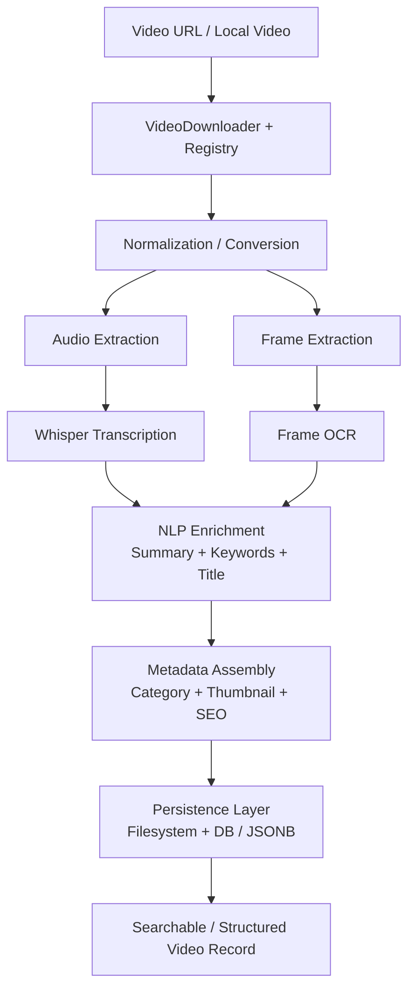

## Part of the Abstract Media Intelligence Platform

This module handles video ingestion and multimodal extraction within a unified media pipeline.

abstract_videos processes:
- video download + metadata registry
- transcription (Whisper) + frame OCR
- NLP enrichment and structured storage

Full system: https://github.com/AbstractEndeavors/abstract-media-intelligence

## **abstract_videos — Video Processing & Media Intelligence Pipeline**

A structured pipeline for transforming video content into **searchable, metadata-rich, and SEO-optimized assets**, combining ingestion, transcription, OCR, NLP enrichment, and persistent storage.

Designed for:

* large-scale video ingestion
* transcription and content extraction
* media indexing and search
* automated metadata generation and SEO

---

## 🔹 What This System Is

abstract_videos is not a downloader or transcription tool — it is a **multi-stage media processing system**:

* ingests video from URLs or local sources
* extracts audio, frames, and text
* performs transcription (Whisper)
* applies OCR to extracted frames
* enriches content via NLP (keywords, summaries, titles)
* persists structured results to database or filesystem

The system produces **fully structured video representations** usable for:

* search
* indexing
* content generation
* analytics

---

## 🔹 Pipeline Overview

```text
Video Input (URL / File)
        ↓
Download + Registry (yt-dlp + metadata)
        ↓
Video Processing
    ├─ Conversion / normalization
    ├─ Audio extraction
    ├─ Frame extraction
        ↓
Content Extraction
    ├─ Transcription (Whisper)
    ├─ OCR on frames
        ↓
NLP Enrichment
    ├─ Summarization
    ├─ Keyword extraction
    ├─ Title generation
        ↓
Metadata Assembly
        ↓
Persistence Layer
    ├─ Database (JSONB structured storage)
    └─ Filesystem (artifacts + media)
```
## Pipeline


---

## 🔹 Core Capabilities

### **Video Ingestion & Registry**

* URL normalization and ID generation
* Metadata extraction via yt-dlp
* Persistent registry with atomic updates and locking 

---

### **Processing Pipeline**

* Video normalization and format handling
* Audio extraction for transcription
* Frame extraction for visual analysis

---

### **Transcription & OCR**

* Whisper-based transcription pipeline
* Frame-level OCR for embedded text
* Combined multimodal text extraction

---

### **NLP & Metadata Enrichment**

* Keyword extraction and refinement
* Title generation from summaries
* Category inference based on content
* Thumbnail selection via frame sharpness analysis 

---

### **Structured Persistence**

* PostgreSQL storage with JSONB fields for:

  * raw info
  * metadata
  * transcripts
  * captions
  * thumbnails
  * aggregated outputs 

* Upsert-based lifecycle management for idempotent processing

---

## 🔹 Dual Pipeline Model (Key Concept)

The system supports **two execution modes**:

### **1. Local / Read-Write Pipeline**

* full processing on local machine
* filesystem-based outputs
* direct artifact generation

---

### **2. Database-Centric Pipeline**

* persistent storage as primary interface
* JSONB-backed structured data
* incremental updates and enrichment

---

### 🔹 Design Intent

> **Database + local modules as primary**
> **External ML (HuggingFace / APIs) as secondary**

This enables:

* offline-first operation
* reproducibility
* plug-and-play ML upgrades

---

## 🔹 Architecture

### **Core Components**

* **VideoDownloader**

  * ingestion + metadata acquisition
* **infoRegistry**

  * centralized state + persistence
* **VideoTextPipeline**

  * orchestrates processing stages
* **Metadata Console**

  * post-processing and optimization (summaries, SEO)
* **Database Layer**

  * structured storage with upsert semantics

---

## 🔹 Key Design Decisions

### **Idempotent Processing**

* all steps tracked via `processed_steps`
* pipeline resumes without duplication
* safe reprocessing of partial runs

---

### **Structured Over Raw**

Everything is stored as structured JSON:

* transcripts
* keywords
* metadata
* derived content

---

### **Multimodal Extraction**

Combines:

* audio → text (transcription)
* image → text (OCR)
* text → meaning (NLP)

---

### **Registry as Source of Truth**

* central video registry
* thread-safe and process-safe updates
* ensures consistency across runs

---

## 🔹 Why This Exists

Most video pipelines:

* stop at transcription
* lack structure
* are not searchable
* are not reusable

abstract_videos transforms video into:

* **structured data**
* **searchable content**
* **SEO-ready metadata**
* **indexable media assets**

---

## 🔹 Example Use Cases

* video → searchable content pipelines
* media indexing platforms
* transcription + analytics systems
* SEO content generation
* LLM-ready dataset creation

---

## 🔹 Integration Context

This system integrates directly with:

* `abstract_hugpy` → NLP / summarization / keyword extraction
* `abstract_ocr` → image/frame OCR
* `abstract_pdfs` → document pipeline

---

## 🔹 Design Philosophy

* **Media is data, not just content**
* **Structure enables reuse**
* **Pipelines should be resumable and deterministic**
* **Local-first, cloud-optional**

---
